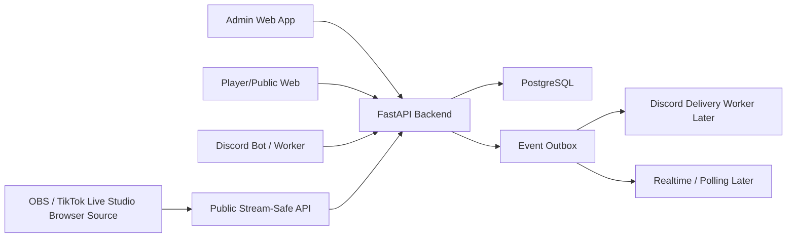
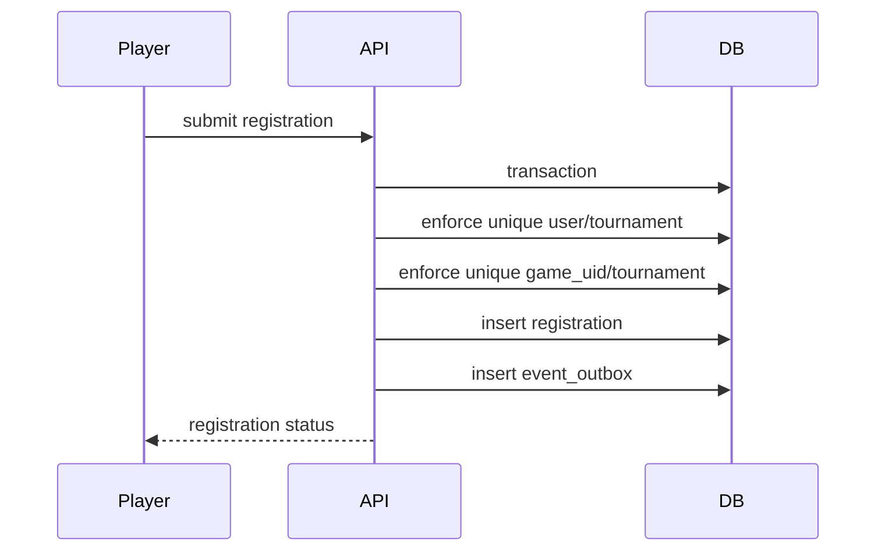
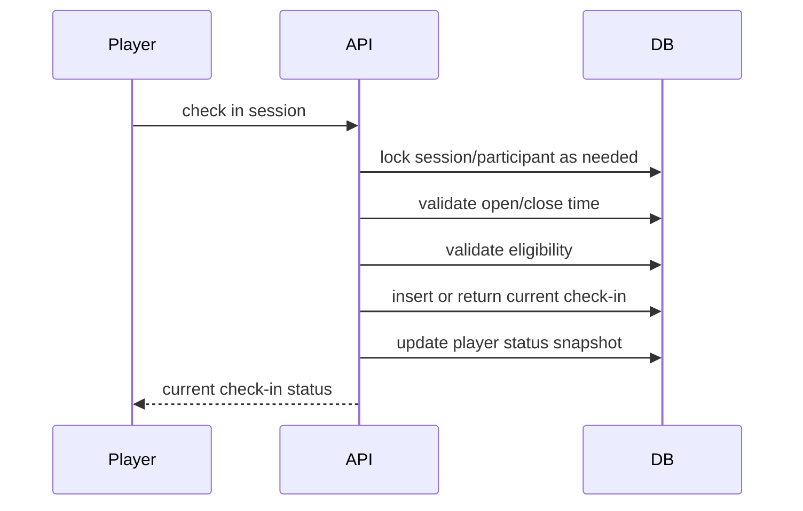
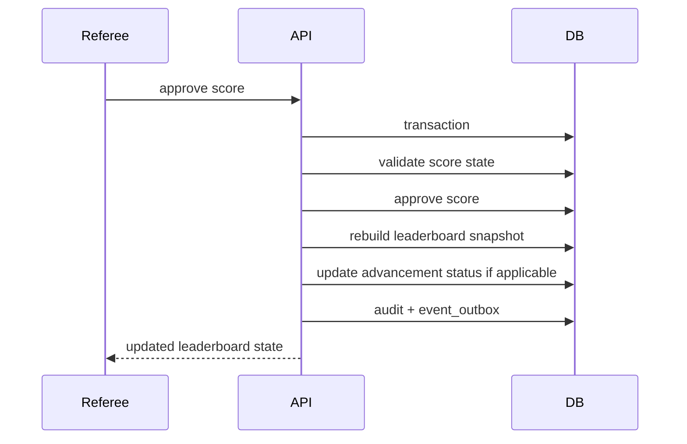
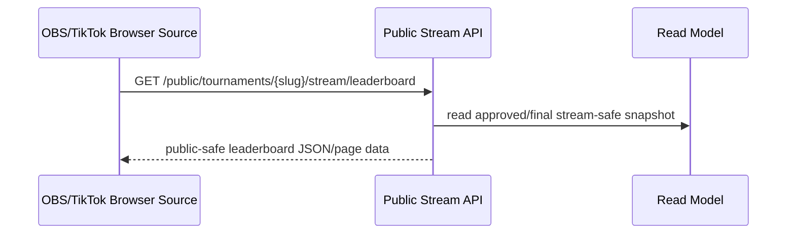

# System Architecture Design

Project: Tournament Operating System  
Subsystem: TTLIVE Tournament OS  
Status: Phase 1 architecture draft  
Primary stack: FastAPI + PostgreSQL

## Purpose

This document translates the Phase 1 SRS into backend architecture.

The goal is to make implementation boundaries clear before writing code.

## Architecture Principles

- PostgreSQL is the source of truth.
- FastAPI owns business logic, permissions, scoring, advancement, and public/private serialization.
- Web, Discord, OBS/TikTok Live Studio, and plugins are clients/helpers only.
- Read paths and write paths should be separated at the service layer.
- Important mutations must create audit logs and event outbox records.
- Public and stream-safe responses must not expose private player/contact/evidence/admin data.

## System Context



## Backend Modules

Phase 1 backend should be split into these modules:

| Module | Responsibility |
| :--- | :--- |
| Identity | users, tokens, global roles, tournament roles |
| Tournament Setup | tournament draft, status, public slug, schedule |
| Rulesets | presets, draft config, validation, immutable lock snapshot |
| Registration | submit, approve, reject, waitlist, withdraw |
| Grouping | generate stages/groups/rounds, group lock, movement audit |
| Check-In | session-level check-in, late override, no-show/replacement state |
| Scoring | placement entry, score calculation, score states |
| Leaderboard | ranking, tie-breaks, snapshots, advancement inputs |
| Advancement | Top N per lobby, final winner, qualification status |
| Disputes | dispute submission, review, accept/reject, correction trigger |
| Evidence | evidence URI validation and private/public visibility rules |
| Audit | mutation logs and reason capture |
| Event Outbox | backend event records for dashboard/Discord/realtime later |
| Public Data | public-safe and stream-safe serializers/read models |
| Export | Excel export first |

## Layering

Recommended code layering:

```text
api/routers
  -> application services
    -> domain services / policies
      -> repositories
        -> PostgreSQL
```

Routers should not contain business rules.

Application services own transactions and orchestration.

Domain services own pure rules such as score calculation, tie-breaks, and validation.

Repositories own database reads/writes.

## Write Services

Write services mutate official state:

- `TournamentSetupService`
- `RuleSetLockService`
- `RegistrationService`
- `GroupGenerationService`
- `CheckInService`
- `ScoreEntryService`
- `ScoreApprovalService`
- `DisputeService`
- `AdvancementPublishService`
- `ExportService`

Every important write service should:

1. validate permissions
2. validate current state
3. use database transaction
4. write official tables
5. write audit log when required
6. write event outbox row
7. update read model synchronously in Phase 1 when needed
8. return current official state or allowed actions

## Read Services

Read/query services should not mutate official state:

- `AdminDashboardQueryService`
- `PlayerStatusQueryService`
- `LeaderboardQueryService`
- `PublicTournamentQueryService`
- `StreamOverlayQueryService`
- `AuditLogQueryService`

Read services may read from snapshots/read models:

- `tournament_dashboard_summaries`
- `leaderboard_snapshots`
- `player_status_snapshots`
- `public_tournament_summaries`
- stream-safe leaderboard/group response or snapshot

## Critical Flows

### Registration Flow



### Check-In Flow



### Score Approval Flow



### Stream Overlay Read Flow



## Concurrency Strategy

Use database constraints first:

- unique registration per tournament/user
- unique game UID per tournament
- unique check-in per session/registration
- unique placement per round/group/game

Use transactions for all important mutations.

Use row-level locks where needed:

- registration capacity and waitlist promotion
- check-in session state
- no-show/replacement
- group generation/regeneration
- score approval/correction
- leaderboard snapshot rebuild

Duplicate requests should return current official state instead of creating duplicate records.

## Event Outbox

Event outbox records should be written inside the same transaction as the official state change.

Initial event names:

- `tournament.status_changed`
- `rule_set.locked`
- `registration.submitted`
- `registration.approved`
- `groups.generated`
- `groups.locked`
- `check_in.completed`
- `score.submitted`
- `score.approved`
- `score.corrected`
- `leaderboard.updated`
- `advancement.updated`
- `dispute.opened`
- `dispute.accepted`
- `dispute.rejected`
- `export.ready`

Phase 1 may process events synchronously or leave them for later workers.

## External Interfaces

### Admin Web

Uses authenticated admin APIs.

Admin APIs may expose private fields only when permission allows.

### Public Web

Uses public-safe APIs.

Public responses must exclude contact data, Discord IDs, private evidence, admin notes, and audit payloads.

### OBS / TikTok Live Studio

Uses stream-safe public endpoints only.

The overlay must not calculate score, rank, or advancement.

### Discord

Discord must call FastAPI.

Discord must not store official tournament state or decide permissions.

## Phase 1 Deployment Shape

Minimum runtime:

- FastAPI app
- PostgreSQL database
- Alembic migrations

Optional later:

- background worker
- WebSocket/SSE service
- Discord worker
- managed file storage

## Open Architecture Questions

- Exact auth mechanism for first backend build.
- Whether Phase 1 frontend is separate React/Next.js or FastAPI-served pages.
- Whether read models are physical tables or read-optimized queries first.
- Whether export jobs are synchronous or queued.
