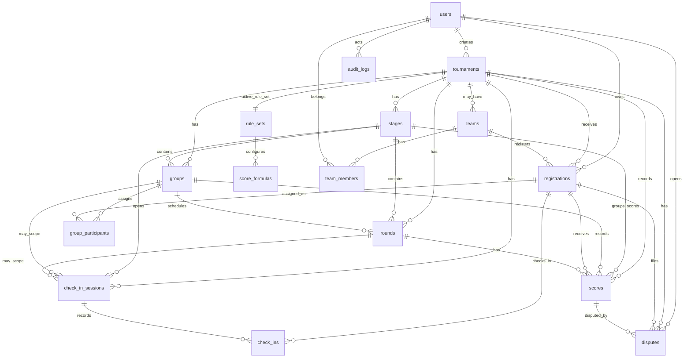

# ER Diagram

Status: Draft for PostgreSQL schema review.

This diagram keeps the MVP centered on solo tournaments while leaving room for teams later.

## Relationship Notes

### `users`

Represents accounts for admins, referees, and players.

MVP may use simple local admin accounts or a minimal auth provider, but business logic should not depend on a specific provider.

### `tournaments`

Owns the event state and references the active rule set and score formula.

Important relationships:

- One tournament has many registrations.
- One tournament has many stages.
- One tournament has one active rule set.
- One tournament has many scores and disputes.

### `rule_sets`

Stores configurable tournament behavior:

- Model
- Lobby size
- Advancement
- Verification
- Lobby assignment
- Score reset policy

The system should lock a rule set before the tournament starts.

### `score_formulas`

Stores placement points, penalties, bye rules, and tie-break order.

This may be one-to-one with `rule_sets` in MVP, but keeping it separate makes future formula versions cleaner.

### `registrations`

Represents a player or team applying to a tournament.

MVP should use solo registration:

- `user_id` required
- `team_id` nullable
- `game_uid` unique per tournament

### `teams` and `team_members`

These exist for future support.

For MVP:

- Keep schema nullable and non-blocking.
- Do not build team workflows unless explicitly chosen.

### `stages`

Represents Round 1, Semi Final, Final, etc.

Stages are generated from the rule set after registration closes.

### `groups`

Represents lobbies inside a stage.

Example: `Round 1 - Lobby A`.

### `group_participants`

Connects approved registrations to groups.

This is where admin movement and advancement status can be tracked.

### `rounds`

Represents a game instance or scoring unit inside a group.

For Golden Spatula:

- Round 1 Lobby A Game 1
- Round 1 Lobby A Game 2

### `check_in_sessions`

Represents one check-in window for a stage, day, group, or round.

MVP should use one session per stage per tournament day. This prevents a Day 1 check-in from incorrectly counting as presence for Day 2, Semi Final, or Final.

### `check_ins`

Represents one participant's status for one check-in session.

A player can have many check-in records across a tournament, but only one per session.

### `scores`

Stores calculated points per round and participant.

The backend calculates total points. Manual total override should be rare and audited.

### `disputes`

Connects player objections to scores.

Accepted disputes should result in score correction and audit log.

### `audit_logs`

Records important mutations.

Keep this generic so it can track registrations, groups, scores, disputes, and rule changes.

## MVP Constraints

Recommended first database constraints:

- Unique `tournaments.public_slug`
- Unique `registrations(tournament_id, user_id)`
- Unique `registrations(tournament_id, game_uid)` when `game_uid` is present
- Unique `group_participants(group_id, registration_id)`
- Unique `check_ins(check_in_session_id, registration_id)`
- Unique `scores(round_id, registration_id)`
- `scores.total_points` must be calculated by service logic, not public clients
- `audit_logs.reason` required for corrections, overrides, and post-lock changes

## Indexes To Plan

Recommended first indexes:

- `registrations(tournament_id, status)`
- `stages(tournament_id, sequence)`
- `groups(stage_id, sequence)`
- `rounds(group_id, sequence)`
- `check_in_sessions(tournament_id, status)`
- `check_in_sessions(stage_id, opens_at)`
- `check_ins(check_in_session_id, status)`
- `check_ins(registration_id, status)`
- `scores(tournament_id, status)`
- `scores(round_id, registration_id)`
- `disputes(tournament_id, status)`
- `audit_logs(entity_type, entity_id)`
- `audit_logs(created_at)`

## Open ER Decisions

- Whether role assignment should be global only or tournament-scoped in Phase 1.
- Whether evidence references should point to external URLs, object storage keys, or a future `attachments` table.
- Whether score formula versions need immutable snapshots after lock.
- Whether check-in sessions are generated from stage schedules or manually created by admin.
